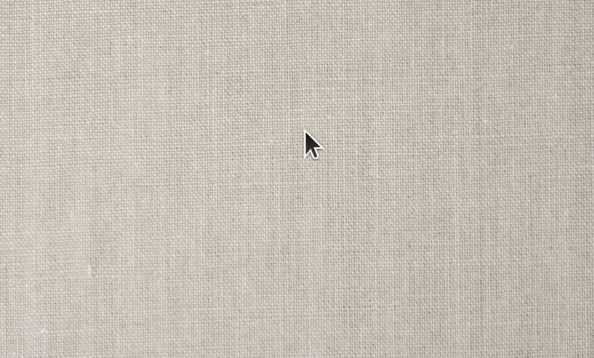

<p align="center">
  <a href="" rel="noopener">
 </a>
</p>

<h3 align="center">Another Z-like Window Switcher</h3>

<div align="center">

[]()
[](https://github.com/trepichio/ulauncher-window-switcher/issues)
[](https://github.com/trepichio/ulauncher-window-switcher/pulls)

 
 
 
 [](/LICENSE)

</div>

---

<p align="center"> Ulauncher extension to switch windows by just typing keywords</p>
    <br>
</p>

## 📝 Table of Contents

- [About](#about)
- [Getting Started](#getting_started)
- [Usage](#usage)
- [Issue after adding extension](#issue)
- [Built Using](#built_using)
- [Author](#author)
- [Acknowledgments](#acknowledgement)
- [Support the Author](#support_author)

## 🧐 About <a name = "about"></a>

I wanted to have an alternative way to switch among different open windows besides using <code>alt+tab</code>. Also, I love using Ulauncher for many things, so I though it would be a good idea to make the window switch by just typing a keyword for it. And I've also been thinking about making any extension that can be used with Ulauncher.

## 🏁 Getting Started <a name = "getting_started"></a>

### Prerequisites

If you don't already have [Ulauncher](https://ulauncher.io/) installed, you can download it from [here](https://ulauncher.io/#Download).

### Installing

After installing, Open Ulauncher Preferences.

Then, click "Add Extension" link:



Insert this repo url on the `"Enter Extension URL"` dialog and click `"Add"`:

```
https://github.com/trepichio/ulauncher-window-switcher
```

Done! 🎉


## 🔧 Issue after adding extension <a name = "issue"></a>

If you see the extension listed after adding it, it's probably working. But if you see an error message, click the `Reload the list` and check if the error message is gone. It should be enough to fix the issue.

## 🎈 Usage <a name="usage"></a>

You can trigger the window switcher extension by typing the <code>s + space</code> default keyword on Ulauncher then any other keyword describing an open window you want to switch to.

You can change to whatever you want by editing the `keyword` property in the extension's properties.

## ⛏️ Built Using <a name = "built_using"></a>

- [Python](https://www.python.org/)

## ✍️ Author <a name = "author"></a>

| [](https://trepichio.github.io) |
|:--------------------------------------------------:|
| [João Trepichio](https://trepichio.github.io)    |
| <a href="https://www.buymeacoffee.com/jtrepichio" target="_blank"></a> |

----

## 🎉 Acknowledgements <a name = "acknowledgement"></a>

- Inspiration from [Saghen/ulauncher-window-switcher](https://github.com/Saghen/ulauncher-window-switcher)

## 👍 Support the Author <a name = "support_author"></a>
💙 If you like this extension, please consider ⭐️ this repository and spread the word.
